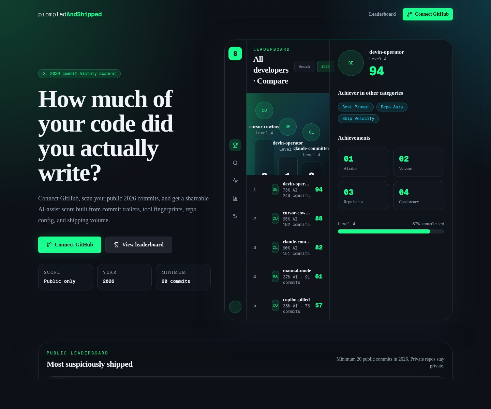
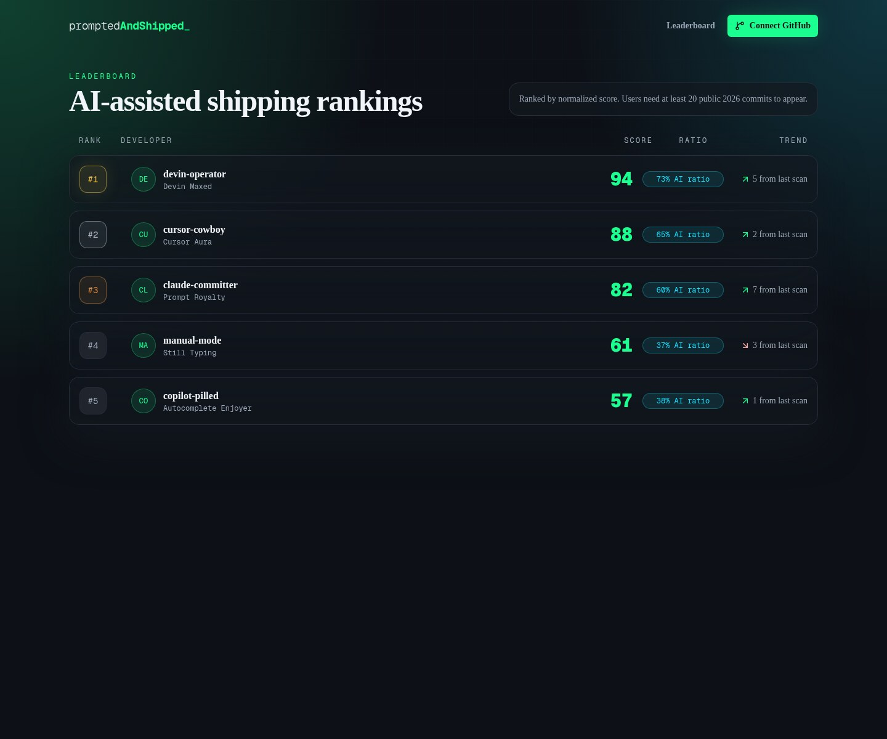
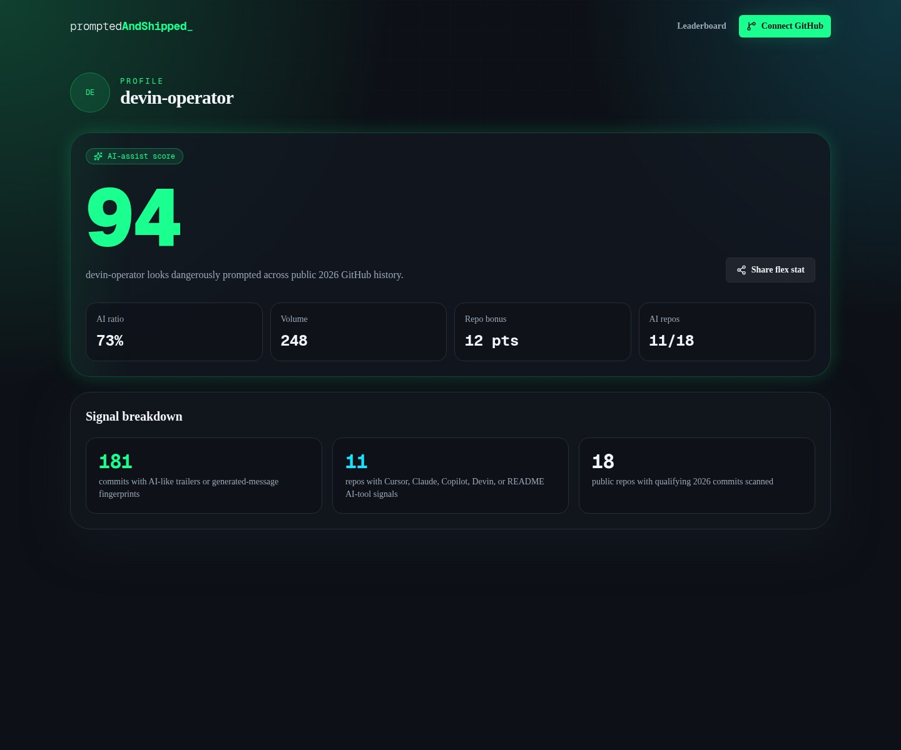
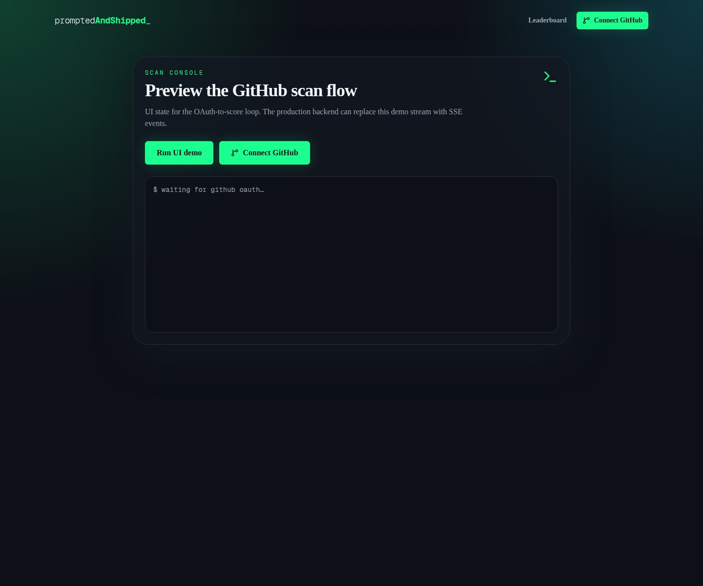

<div align="center">
  

# Prompt2Ship

### Public GitHub commits go in. Developer shipping clout comes out.

[](https://nextjs.org/)
[](https://www.typescriptlang.org/)
[](https://tailwindcss.com/)

</div>

## What is Prompt2Ship?

Prompt2Ship is a developer-native leaderboard for the AI-assisted shipping era. Connect GitHub, scan public 2026 commit activity, and turn the signal into a shareable profile card that shows how much momentum you are shipping with.

It is built for makers, indie hackers, dev teams, and anyone who has ever looked at a commit graph and thought: “nice, but can it roast me a little?”

## What it does

- **Scans public GitHub activity** for 2026 shipping signals.
- **Calculates a shareable score** using public repos, commit volume, AI-assist indicators, and momentum.
- **Ranks builders on a leaderboard** so the “shipping arc” becomes visible.
- **Creates profile cards** that are ready to share when the score is hot.
- **Shows scan progress** in a terminal-inspired UI because plain loading spinners do not ship.

## Who it is for

- Builders who want a fun public snapshot of their shipping streak.
- Teams running AI tooling adoption challenges.
- Hackathon crews comparing who is actually pushing code.
- Anyone who believes `git commit` deserves a tiny scoreboard and maybe a confetti cannon.

## Product preview

| Landing page | Leaderboard |
| --- | --- |
|  |  |

| Shareable profile | Scan progress |
| --- | --- |
|  |  |

## Pages in the MVP

```tsx
/                 // Landing page, Connect GitHub CTA, leaderboard preview
/leaderboard      // Full public leaderboard shell
/u/[username]     // Shareable score/profile card
/scan             // Scan-progress console demo
```

## Stack

- Next.js App Router
- TypeScript
- Tailwind CSS
- shadcn-style component primitives
- Supabase client wiring for future GitHub OAuth integration
- Mock data fallback so the UI still looks alive before credentials are configured

## Local setup

```bash
npm install
cp frontend/.env.example frontend/.env.local
npm run dev --workspace frontend
```

No Supabase credentials are required for the current UI preview; it falls back to mock leaderboard/profile data.

## Validation

```bash
npm run lint
npm run typecheck
npm run build
```

## Tiny product promise

Prompt2Ship will not make your code better, but it will make your shipping look dangerously organized.
